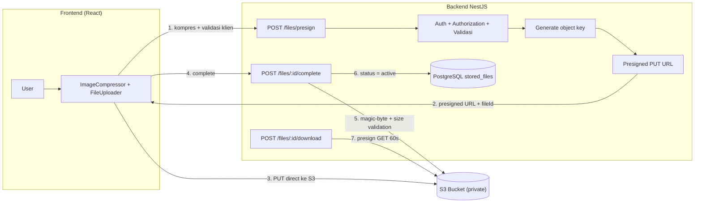

# AWS S3 Storage — Implementation Plan

> **Scope:** Migrasi penyimpanan file WargaNet dari local disk (Multer `diskStorage`) ke **Amazon S3** dengan presigned URL. Berlaku untuk baseline **100 KK / ±350 warga / 1 RT**.
>
> **Prinsip:** Security first, private by default, least privilege, cost efficient, simple for MVP, scalable untuk multi-RT, tanpa AWS service yang tidak perlu. Database menyimpan metadata, S3 menyimpan file. Tidak ada bucket public.

## 1. Executive Summary

WargaNet saat ini menyimpan seluruh file upload ke **local disk** (`apps/backend/uploads/{announcements,payments,logos}`) via Multer `diskStorage`, lalu diserve statis lewat `app.useStaticAssets('/uploads/')` (`src/main.ts:21`) dan proxy `/uploads` di Vite. Pendekatan ini bekerja, tetapi:

- Tidak scalable untuk multi-RT (storage terikat disk VPS).
- Rawan kehilangan data (tanpa backup/versioning, tanpa lifecycle).
- Semua traffic melewati VPS (single point of failure).
- Tidak ada audit trail terpusat.

Dokumen ini merancang migrasi ke S3 dengan alur **presigned direct upload/download** (file tidak pernah melewati backend), bucket private, metadata di tabel `stored_files`, dan menjaga kompatibilitas API yang sudah ada.

**Estimasi biaya:** ~USD 1,50/bulan (≈ IDR 24.500) untuk skenario normal baseline 100 KK. Biaya aktual sangat kecil dibandingkan biaya VPS, sehingga prioritas adalah *security correctness*, bukan penghematan mikro.

**Estimasi kompleksitas: Medium** untuk Phase 1 (MVP), Medium untuk Phase 2 (hardening), High untuk Phase 3 (scaling).

## 2. Current State Analysis

### Kondisi upload saat ini

| Komponen | Lokasi | Detail |
|---|---|---|
| Lampiran pengumuman | `src/announcements/announcements.controller.ts` | `POST /announcements/attachment`, Multer diskStorage, 5MB, `.jpg|.jpeg|.png|.webp|.pdf`, simpan `url`/`name` string |
| Bukti bayar | `src/bills/bills.controller.ts` | `POST /bills/payments/:id/proof`, Multer diskStorage, 5MB, `.jpg|.jpeg|.png`, simpan `proofUrl`/`proofName` |
| Logo pengaturan | `src/settings/settings.controller.ts` | `POST /settings/logo`, Multer diskStorage, 2MB, `.jpg|.jpeg|.png|.svg|.webp` (⚠️ **SVG diizinkan — risiko XSS**) |
| Static serving | `src/main.ts:21` | `app.useStaticAssets(uploads, { prefix: '/uploads/' })` |
| Proxy dev | `apps/frontend/vite.config.ts` | `/api` dan `/uploads` dialihkan ke backend |

### Masalah yang diperbaiki S3

1. **Storage terbatas disk VPS** — file tak terpisahkan dari server aplikasi.
2. **Tanpa versioning / backup** — hapus file = hilang permanen.
3. **Tanpa lifecycle** — semua file standar selamanya.
4. **Metadata berupa string kolom** (`proofUrl`, `attachmentUrl`) — tidak ada file-id terpusat, audit/relasi lemah.
5. **SVG di logo** — risiko XSS bila diserve inline.
6. **Nama file `Date.now()+random+ext`** — tidak ada validasi magic bytes, hanya ekstensi.
7. **Semua byte lewat VPS** — egress VPS mahal dan bottleneck.

### Arsitektur target (presigned flow)



**Kenapa presigned direct upload lebih baik daripada proxy `User → Backend → S3`:**

| Aspek | Proxy via Backend | Presigned direct |
|---|---|---|
| Bandwidth | Semua lewat VPS (single node) | Langsung ke S3 |
| Egress | Dikenakan pada instance (potensi mahal) | Dikenakan hanya saat download/GET |
| Memori/VPS | Multer buffer + tulis disk | Tidak ada byte lewat proses |
| Fail point | Backend down = upload down | Backend hanya koordinasi (ringan) |
| Keamanan | Tetap perlu auth di S3 path | Control via expiry + prefix + size condition |

**Konsekuensi keamanan:** karena bucket tetap private dan akses hanya via presigned URL, authorization tetap dipaksa lewat backend di setiap `presign`/`download`. S3 tidak pernah melayani request langsung tanpa presigned URL.

## 3. S3 Bucket Design

### Struktur key

```text
s3://warganet-{env}/{tenant}/{module}/{yyyy}/{mm}/{uuid}.{ext}
```

Contoh:

```text
warganet-production/
└── rt04-rw010-satriamekar/
    ├── profile/2026/08/3f2a1b9c-....webp
    ├── payment-proof/2026/08/7c1d0f2e-....jpg
    ├── document/2026/08/9e8f7d6a-....pdf
    ├── announcement/2026/08/0b1c2d3e-....pdf
    ├── activity/2026/08/4a5b6c7d-....webp
    ├── polling/2026/08/...
    ├── suara-warga/2026/08/...
    └── logo/2026/08/...
```

### Keputusan desain

1. **Hapus `{resource_id}` dari key.** Saat presign, resource belum tentu ada (attachment announcement di-upload *sebelum* announcement dibuat, lihat flow saat ini). Relasi file↔entity disimpan di kolom `module` + `entity_id` di DB, bukan di key. Ini menghindari operasi COPY/MOVE yang berat.
2. **`{tenant}` = RT code stabil** (mis. `rt04-rw010-satriamekar` dari `SystemSetting`/`Family`), bukan UUID. 1 tenant saat ini, struktur siap multi-RT tanpa refactor.
3. **`{uuid}.{ext}`** — extname diambil dari whitelist **server-side** (jangan pernah percaya filename user → cegah path traversal). UUID menghindari tabrakan & menyembunyikan nama asli.
4. **Prefix `pending/` tidak perlu** — gunakan mekanisme status `pending`→`active` di DB (lihat §5), object langsung ditulis ke key final. Cleanup job menghapus object dari record `pending` yang kadaluarsa.

## 4. AWS Resource Layout

Gunakan region **ap-southeast-3 (Jakarta)** — dekat user, latency rendah.

| Resource | Nama | Deskripsi |
|---|---|---|
| S3 bucket | `warganet-dev` / `warganet-staging` / `warganet-prod` | Private, SSE-S3, versioning ON |
| IAM user | `warganet-backend-{env}` | 1 user khusus backend, policy scoped §7 |
| IAM policy | `WargaNetBackendS3{env}` | Least privilege §7 |
| CloudWatch | metric `storage`, `NumberOfObjects`, alarm egress | §21 |
| CloudTrail | trail `warganet-{env}` (data events `s3:DeleteObject`) | §22 |

**Infrastruktur berjalan di VPS + PM2** (self-hosted runner, `scripts/deploy.sh`) → **IAM Role tidak tersedia native**. Gunakan akses key scoped di Phase 1; opsi IAM Roles Anywhere / ECS Fargate di Phase 3 (§24).

## 5. Database Design

Tambah model ke `apps/backend/prisma/schema.prisma`, mengikuti konvensi existing (uuid PK, `@map` snake_case, soft delete `deletedAt`):

```prisma
model StoredFile {
  id             String    @id @default(uuid())
  tenantId       String    @map("tenant_id")
  uploadedBy     String    @map("uploaded_by")
  module         String                        // profile, payment-proof, document, announcement, activity, polling, suara-warga, logo
  entityType     String?   @map("entity_type") // Payment, Announcement, User, dst.
  entityId       String?   @map("entity_id")
  bucket         String    @default("warganet-production")
  storageKey     String    @unique @map("storage_key")
  originalName   String    @map("original_name")
  mimeType       String    @map("mime_type")
  fileSize       Int       @map("file_size")
  checksumSha256 String?   @map("checksum_sha256")
  status         String    @default("pending") // pending, active, orphaned, failed
  createdAt      DateTime  @default(now()) @map("created_at")
  updatedAt      DateTime  @updatedAt @map("updated_at")
  deletedAt      DateTime? @map("deleted_at")

  uploader User? @relation(fields: [uploadedBy], references: [id])

  @@map("stored_files")
  @@index([tenantId, module])
  @@index([module, entityId])
  @@index([status, createdAt])
  @@index([uploadedBy])
}
```

### Keputusan

- **PK:** `id` (uuid, konsisten dengan model existing).
- **Foreign key:** `uploadedBy → users.id` (nullable relasi agar soft-delete user tidak merusak relasi).
- **Unique constraint:** `storageKey` — dasar reconciliation object S3 ↔ record.
- **Polymorphic relasi:** `module` + `entityId` (bukan FK prisma ke semua entity) supaya modul storage tetap generik dan tak membentuk cycle.
- **Soft delete:** `deletedAt`. Hapus object S3 di background setelah record di-soft-delete (hard-delete object S3, record tetap untuk audit).
- **Status lifecycle:** `pending` (presign, sebelum upload selesai) → `active` (complete) → `failed`/`orphaned` (cleanup job).

### Backfill entity existing

Untuk relasi yang benar, ubah kolom string menjadi fileId:

- `Payment.proofUrl/proofName` → tambah `Payment.proofFileId String? @map("proof_file_id")` relasi ke `StoredFile` (keep kolom lama selama transisi, drop di migration lanjutan).
- `Announcement.attachmentUrl/attachmentName` → tambah `Announcement.attachmentFileId`.
- `SystemSetting` logo → simpan `storageKey` di value; render via `GET /files/:id/download`.

## 6. File Upload Flow

### Alur lengkap ("reserve-then-upload")

```text
1. Frontend mengecek ukuran & ekstensi, lalu kompres gambar (client-side)
2. POST /api/v1/files/presign  { module, entityType?, entityId?, fileName, mimeType, size }
3. Backend: autentikasi session → authorization per-module (RBAC existing)
4. Backend: validasi module/mimeType/size terhadap whitelist
5. Backend: INSERT stored_files (status=pending) → dapat fileId + storageKey
6. Backend: generate presigned PUT (expires 5 menit, condition content-length & content-type)
7. Response: { fileId, uploadUrl, headers }
8. Frontend: PUT langsung ke S3 (XHR + onUploadProgress, bisa dibatalkan)
9. POST /api/v1/files/:id/complete
10. Backend: GetObject (range 1KB) → cek magic bytes → cek size vs stored
11. Backend: status=active, isi checksum_sha256
```

### Handing edge cases

| Kasus | Penanganan |
|---|---|
| Upload gagal / user cancel | Frontend PUT error → `DELETE /files/:id` (hapus object + soft-delete record). Alternatif: biarkan `pending`, cleanup job bersihkan < 24 jam |
| Presigned URL expired | PUT → 403 → frontend minta presign baru (re-trigger `POST /files/presign` dengan `fileId` yang sama → URL baru) |
| S3 sukses, DB gagal | Object yatim (status pending tidak pernah active) → cleanup job **delete object** yang record-nya `pending` > 24 jam (§9) |
| DB record ada, object hilang | **Reconciliation job**: `HeadObject` semua record active → 404 = mark `orphaned` + alert Telegram |
| File dihapus | Soft-delete DB (audit trail) → hapus object S3 di background (retry on failure) |
| User tanpa permission | 401 / 403 `ForbiddenException`, tidak pernah menerima presigned URL |

## 7. File Download Flow

```text
GET /api/v1/files/:id/download
→ auth session
→ cek hak akses sesuai module (own/role) → cek status=active & deletedAt=null
→ generate presigned GET (expires 60 detik)
   ResponseContentDisposition = inline | attachment (sesuai module)
   ResponseContentType = dipaksa dari stored.mimeType
→ respon 302 Redirect ke presigned URL
```

**Kenapa 302 redirect:** ``, `<a download>` bekerja native tanpa JS, presigned URL tidak bocor ke state React / WebStorage. Metadata tersedia via `GET /files/:id`.

Alternatif (jika frontend butuh URL eksplisit): respon `{ url }` tanpa redirect. Pilih **302 untuk MVP** karena paling sederhana.

## 8. Security Design

### Checklist konfigurasi WargaNet

| Item | Keputusan |
|---|---|
| Block Public Access | **Semua ON** (4 toggle) |
| Bucket Policy | Hanya enforce `aws:SecureTransport` (lihat §10); akses utama via IAM |
| IAM | 1 user backend per env; **tidak ada** `s3:*` |
| Default encryption | **SSE-S3 (AES-256)**. KMS tidak perlu di MVP (presigned kompatibel penuh, hemat ~$0,03/bulan/CMK + request fee) |
| Object Ownership | Bucket owner enforced |
| Versioning | **ON** — proteksi hapus tak sengaja; noncurrent di-expire §11 |
| CORS | Origin terbatas `https://app.<domain>` (§11) |
| CloudTrail | Management (default) + data events `s3:DeleteObject` |
| Server access log | Skip di MVP (pakai CloudWatch metric + CloudTrail delete) |
| Validasi file | Whitelist ekstensi + magic bytes + size limit; dicek saat `complete` (§13) |
| Rate limiting | `@nestjs/throttler` existing; throttle ketat pada `/files/presign` (§16) |
| Presigned URL | PUT 5 menit, GET 60 detik. Pastikan region & credentials konsisten |
| Audit trail | Reuse global `AuditLogInterceptor` |
| CORS backend | `main.ts` sudah set `credentials: true`; pastikan `FRONTEND_URL` dipin |
| **SVG** | **Hapus `.svg` dari whitelist logo** — risiko XSS (§13) |

### IAM Policy (least privilege)

```json
{
  "Version": "2012-10-17",
  "Statement": [
    {
      "Sid": "WargaNetBackendObjectOps",
      "Effect": "Allow",
      "Action": [
        "s3:PutObject",
        "s3:GetObject",
        "s3:GetObjectAttributes",
        "s3:DeleteObject",
        "s3:AbortMultipartUpload",
        "s3:PutObjectTagging",
        "s3:GetObjectTagging",
        "s3:GetObjectVersion"
      ],
      "Resource": "arn:aws:s3:::warganet-{env}/*"
    },
    {
      "Sid": "WargaNetBackendBucketOps",
      "Effect": "Allow",
      "Action": ["s3:ListBucket", "s3:GetBucketLocation"],
      "Resource": "arn:aws:s3:::warganet-{env}"
    }
  ]
}
```

> **Catatan kredensial:** deploy berjalan di VPS + PM2 (tanpa instance profile). Phase 1 pakai akses key scoped di environment (bukan hardcode file), **rotasi rutin**, asli disimpan di Secret Manager/1Password. Tidak ada key di repository (`.env` sudah di-gitignore).

## 9. Orphan File Management

Reuse `@nestjs/schedule` (sudah terpasang, `ScheduleModule.forRoot()` di `app.module.ts:36`) + Telegram bot (sudah ada `TELEGRAM_BOT_TOKEN`) untuk alert.

### Cron harian

```text
SchedulerService (CronExpression.EVERY_DAY_AT_3AM)
├── Job 1 — Orphan cleanup (S3 ada, DB pending)
│   StoredFile status=pending && createdAt < 24 jam
│     → HeadObject → jika object ada & belum pernah complete
│       → DeleteObject + mark status=failed
├── Job 2 — Reconciliation (DB ada, S3 hilang)
│   StoredFile status=active
│     → HeadObject → 404 → mark status=orphaned + notif Telegram
└── Job 3 — Hard delete
    StoredFile status=failed/orphaned && deletedAt < 30 hari
      → DeleteObject (idempotent) + hapus record
```

Setiap aksi dicatat ke `AuditLog` (`action: files.cleanup`). Backup plan: retention 30 hari sebelum purge.

## 10. Bucket Policy

Bucket policy hanya untuk enforce TLS (akses utama via IAM):

```json
{
  "Version": "2012-10-17",
  "Statement": [
    {
      "Sid": "DenyInsecureTransport",
      "Effect": "Deny",
      "Principal": "*",
      "Action": "s3:*",
      "Resource": ["arn:aws:s3:::warganet-{env}", "arn:aws:s3:::warganet-{env}/*"],
      "Condition": {
        "Bool": { "aws:SecureTransport": "false" }
      }
    }
  ]
}
```

## 11. Lifecycle & CORS

### Lifecycle (cost-efficient untuk skala 100 KK)

Glacier/Deep Archive **tidak layak** untuk skala ini (minimum duration + retrieval fee; tambahan storage hanya ~0,5GB/bulan — hemat yang bisa dicapai < $0,10/bulan). Aturan final:

```json
{
  "Rules": [
    {
      "ID": "std-to-ia-after-90d",
      "Status": "Enabled",
      "Filter": { "Prefix": "" },
      "Transitions": [{ "Days": 90, "StorageClass": "STANDARD_IA" }]
    },
    {
      "ID": "expire-noncurrent-30d",
      "Status": "Enabled",
      "Filter": { "Prefix": "" },
      "NoncurrentVersionExpiration": { "NoncurrentDays": 30 }
    },
    {
      "ID": "abort-incomplete-multipart",
      "Status": "Enabled",
      "Filter": { "Prefix": "" },
      "AbortIncompleteMultipartUpload": { "DaysAfterInitiation": 7 }
    }
  ]
}
```

### CORS

```json
[
  {
    "AllowedOrigins": ["https://app.warganet.id"],
    "AllowedMethods": ["PUT", "GET", "HEAD"],
    "AllowedHeaders": ["Content-Type", "Content-Length", "Content-MD5", "x-amz-*"],
    "ExposeHeaders": ["ETag", "x-amz-request-id"],
    "MaxAgeSeconds": 3600
  }
]
```

## 12. File Validation Standard

### Limit per module

| Module | Format | Maks |
|---|---|---|
| `profile` | JPG, JPEG, PNG, WebP | 2 MB |
| `payment-proof` | JPG, JPEG, PNG, WebP, PDF | 5 MB |
| `document` | PDF | 10 MB |
| `announcement` | JPG, JPEG, PNG, WebP, PDF | 5 MB |
| `activity` | JPG, JPEG, PNG, WebP | 3 MB |
| `polling` | JPG, JPEG, PNG, WebP | 3 MB |
| `suara-warga` | JPG, JPEG, PNG, WebP | 3 MB |
| `logo` | JPG, JPEG, PNG, WebP (⚠️ **tanpa SVG**) | 2 MB |

Limit tersebut **tepat** untuk MVP. Risiko yang dimitigasi:

| Risiko | Mitigasi |
|---|---|
| File terlalu besar | Limit size di presign (condition `content-length-range`) + cek ulang saat complete |
| Malicious file / executable | Whitelist ekstensi + extension di-generate server-side (`uuid.ext`) |
| Fake extension / MIME spoofing | **Magic bytes check** (GetObject range 1KB) saat `complete` |
| SVG/XSS | Hapus SVG dari whitelist; saat fase lanjut jika tetap dibutuhkan, serve dengan `Content-Disposition: attachment` + `nosniff` |
| Zip bomb / decompression | Tidak relevan — whitelist hanya image & PDF, tanpa arsip |
| Path traversal | Key selalu di-generate backend (`uuid.ext`); filename user hanya disimpan sebagai `originalName` metadata |
| PDF berbahaya (JS/acroform) | Render via `<iframe sandbox>` / viewer; AV scan (ClamAV Lambda) = fase 3 |

## 13. Image Optimization

**Pilihan: kompresi client-side (`browser-image-compression`) → WebP/JPEG sebelum presigned upload.**

Ini satu-satunya opsi yang *tidak merusak* alur direct-upload. Alternatif dievaluasi:

| Opsi | Biaya | Kompleksitas | Cocok MVP? |
|---|---|---|---|
| **Client-side compression** | Nol | Rendah | ✅ Direkomendasikan |
| Backend resize (sharp) | Butuh byte lewat backend → pecah alur presigned | Tinggi | ❌ |
| Lambda image processing | $ per invokasi + konfigurasi trigger | Sedang | ❌ Fase 3 |

Pipeline: `Upload user → validasi klien → resize max 1920px → kompresi (quality 0.8) → WebP jika didukung → presigned PUT`. Tambahan biaya hosting frontend (bandwidth) tidak signifikan di skala ini.

## 14. Storage Estimation

Asumsi ukuran file (setelah kompresi): profil 150KB, bukti 250KB, kegiatan 300KB, suara-warga 150KB, dokumen (PDF) 3MB.

### Skenario

| Skenario | Profil (awal) | Bukti/mo | Kegiatan/mo | Suara/mo | Dokumen/mo |
|---|---|---|---|---|---|
| Conservative | 350 × 150KB | 150 × 250KB | 80 × 300KB | 100 × 150KB | 30 × 3MB |
| **Normal** | 350 × 150KB | 350 × 250KB | 200 × 300KB | 300 × 150KB | 100 × 3MB |
| Heavy | 350 × 150KB | 500 × 250KB | 400 × 300KB | 600 × 150KB | 200 × 3MB |

### Pertumbuhan storage

| Skenario | +/bulan | Tahun 1 | Tahun 2 | Tahun 3 |
|---|---|---|---|---|
| Conservative | ~0,16 GB | ~2 GB | ~4 GB | ~6 GB |
| **Normal** | ~0,48 GB | ~6 GB | ~12 GB | ~18 GB |
| Heavy | ~0,91 GB | ~11 GB | ~22 GB | ~33 GB |

## 15. AWS Cost Estimation

**Asumsi harga:** region Jakarta (ap-southeast-3, nominal ~setara us-east-1): S3 Standard $0,023/GB-mo, Standard-IA $0,0125/GB-mo, PUT $0,005/1k, GET $0,0004/1k, LIST $0,005/1k, data transfer out $0,09/GB, CloudWatch metric $0,30/metric-mo. Kurs **IDR 16.300/USD**. KMS tidak dipakai.

### Baseline Normal (100 KK / ±350 warga)

| Komponen | /bulan USD | /bulan IDR |
|---|---|---|
| S3 Storage (yr2: ~3GB std + ~6GB IA) | $0,13 | 2.100 |
| PUT (~1.000) | $0,005 | 82 |
| GET presigned (~10k) | $0,004 | 65 |
| LIST/DELETE | $0,005 | 82 |
| **Data egress (~8GB)** | **$0,72** | 11.740 |
| CloudWatch (2 metric) | $0,60 | 9.780 |
| **Total** | **~$1,50** | **~24.500** |

### Per skenario

| Scenario | Storage | Request | Transfer | **Total/month** |
|---|---|---|---|---|
| Conservative | $0,06 | $0,01 | $0,27 | **~$0,60** |
| Normal | $0,13 | $0,02 | $0,72 | **~$1,50** |
| Heavy | $0,25 | $0,03 | $1,80 | **~$2,50** |

Per KK: ~IDR 245/bulan. Per warga: ~IDR 70/bulan. Per tahun Normal: ~IDR 295.000.

> **Insight:** biaya didominasi **data egress** (download), bukan storage. Monitor egress lebih penting daripada optimalisasi storage class.

## 16. API Design

Prefix `api/v1`. Semua endpoint butuh session Better Auth. Error format konsisten NestJS (`{ statusCode, message, error }`), pesan Bahasa Indonesia.

### `POST /files/presign`

- **Auth:** session required. **Authz:** akses module sesuai role (e.g. `payment-proof` = anggota keluarga terkait / bendahara).
- **Request:**
```json
{ "module": "announcement", "entityType": "Announcement", "entityId": null,
  "fileName": "undangan.jpg", "mimeType": "image/jpeg", "size": 350000 }
```
- **Success 201:**
```json
{ "fileId": "uuid", "uploadUrl": "https://s3..../presigned...", "expiresIn": 300,
  "headers": { "Content-Type": "image/jpeg" }, "storageKey": "rt04-.../announcement/2026/08/uuid.jpg" }
```
- **Errors:** `400` whitelist tidak sesuai (`mimeType`/`size`/`module` invalid), `401` unauthenticated, `403` unauthorized, `429` rate limit.

### `POST /files/:id/complete`

- **Auth:** session + pembuat file. **Request:** `{}` (atau `etag` opsional).
- **Success 200:**
```json
{ "fileId": "uuid", "status": "active", "checksumSha256": "...", "fileSize": 350000 }
```
- **Errors:** `404` file tidak ada, `409` status bukan `pending`, `422` magic bytes gagal / size mismatch.

### `GET /files/:id`

- **Auth:** session + hak akses module. **Success 200:** metadata `{ id, module, originalName, mimeType, fileSize, createdAt }`.
- **Errors:** `401`, `403`, `404`.

### `GET /files/:id/download`

- **Auth:** session + hak akses module. **Success 302** `Location: <presigned-url>` (expires 60 detik).
- **Errors:** `401`, `403`, `404`, `409` status bukan `active` / soft-deleted.

### `DELETE /files/:id`

- **Auth:** session + owner/admin. **Success 200:** `{ status: "deleted" }` (soft-delete DB + hapus object S3 di background).
- **Errors:** `401`, `403`, `404`.

## 17. Backend Implementation (NestJS)

### Folder structure

```text
apps/backend/src/storage/
├── storage.module.ts
├── storage.controller.ts        # /files/*
├── storage.service.ts           # orchestration: presign, complete, download, delete
├── storage.repository.ts        # akses StoredFile via Prisma
├── storage.scheduler.ts         # @nestjs/schedule cleanup + reconciliation
├── dto/
│   ├── presign-file.dto.ts
│   └── complete-file.dto.ts
├── interfaces/
│   └── storage-provider.ts      # interface abstraction
└── providers/
    ├── s3-storage.provider.ts   # @aws-sdk/client-s3 + s3-request-presigner
    └── local-storage.provider.ts # fallback dev/test (MinIO/LocalStack via endpoint)
```

### Dependensi (modern AWS SDK v3)

```bash
pnpm --filter @warganet/backend add @aws-sdk/client-s3 @aws-sdk/s3-request-presigner
```

> Gunakan SDK v3. **Jangan** `aws-sdk` v2 (deprecated).

### Konfigurasi env (`apps/backend/.env`)

```env
AWS_REGION=ap-southeast-3
S3_BUCKET=warganet-prod
S3_PRESIGNED_UPLOAD_EXPIRES=300
S3_PRESIGNED_DOWNLOAD_EXPIRES=60
# VPS/Phase 1 — gunakan IAM role di Phase 3
AWS_ACCESS_KEY_ID=
AWS_SECRET_ACCESS_KEY=
# Opsional untuk dev/test — arahkan ke MinIO/LocalStack
S3_ENDPOINT=
```

`StorageService` memakai default credential chain (boundary: akses key bila env diisi; di Fargate nanti otomatis pakai role). Contoh inti `S3StorageProvider` menggunakan `getSignedUrl` dari `@aws-sdk/s3-request-presigner` dengan kondisi `content-length-range` dan `x-amz-checksum-*` bila berlaku.

### Integrasi dengan modul existing

- Refactor `announcements.controller.ts`, `bills.controller.ts` (proof), `settings.controller.ts` (logo) untuk memakai `StorageService` (replace Multer diskStorage).
- `POST /authz` helper: fungsi `assertFileAccess(user, module, entityId)` reuse `resolveAuthContext`.
- Hapus `app.useStaticAssets('/uploads/')` di `main.ts` setelah masa transisi; hapus proxy `/uploads` di `vite.config.ts`.

## 18. Frontend Implementation (React)

### Komponen

```text
apps/frontend/src/components/files/
├── FileUploader.tsx        # generik: XHR PUT, progress, cancel, retry
├── ImageUploader.tsx       # wrap FileUploader + preview + client compression
├── DocumentUploader.tsx    # wrap FileUploader untuk PDF
├── FilePreview.tsx         # /<iframe> via GET /files/:id/download
├── FileDownload.tsx        # <a download> memicu presigned GET
├── UploadProgress.tsx      # bar progress (axios onUploadProgress)
└── UploadError.tsx         # state error + retry/cancel
```

### Alur FileUploader

```ts
// 1. pilih file → validasi size+type (duplikasi whitelist ringan di klien)
// 2. kompres gambar (browser-image-compression) jika module image
// 3. POST /files/presign
// 4. axios.put(uploadUrl, file, { headers, onUploadProgress })
// 5. handle 403 (expired) → minta presign ulang → retry
// 6. POST /files/:id/complete
```

### Refactor halaman existing

| Halaman | File | Perubahan |
|---|---|---|
| Bukti bayar | `routes/BillsPage.tsx` `handleUploadProof` | ganti multipart → `PaymentProofUploader` |
| Lampiran berita | `routes/AnnouncementsPage.tsx` `handleAttachmentUpload` | ganti → `DocumentUploader` (keep `POST /announcements` body `attachmentFileId`) |
| Logo | `routes/SettingsPage.tsx` `handleLogoUpload` | ganti → `ImageUploader`, logo diserve via presigned GET |

### API client

Tambah helper di `services/api.ts` (atau `services/storage.ts`) untuk presign/complete/download; axios axios instance existing dipakai.

## 19. AWS Infrastructure (per service)

| Service | MVP? | Production? | Kapan tambah | Estimasi biaya | Benefit |
|---|---|---|---|---|---|
| **S3** | ✅ | ✅ | Mulai | lihat §15 | Storage utama |
| **IAM** | ✅ | ✅ | Mulai | $0 | Keamanan akses |
| **CloudWatch** | ✅ | ✅ | Mulai | $0,60/mo | Metric + alarm |
| **CloudTrail** | ✅ | ✅ | Mulai | $0–$0,10/M events | Audit |
| CloudFront | ❌ | Opsional | Egress > 10GB/bulan | ~$0,085/GB + $0,01/1k req | Cache edge, egress lebih murah |
| Lambda | ❌ | Fase 3 | Thumbnail/AV scan | per invokasi | Prosesing async |
| EventBridge/SQS | ❌ | ❌ | Fase 4 | per event | Event-driven cleanup |
| Replication (CRR) | ❌ | ❌ | Enterprise | 2× storage | DR lintas-region |

**Prinsip:** jangan menambah service hanya karena tersedia.

## 20. Backup & Disaster Recovery

| Aspek | MVP | Production | Enterprise |
|---|---|---|---|
| S3 Versioning | ON | ON | ON |
| Lifecycle | Abort multipart 7d | + expire noncurrent 30d | + CRR |
| Backup DB | Postgres dump periodik (existing) | + point-in-time | + cross-region |
| Recovery test | Bulanan sampling `HeadObject` | Restore object dari versi lama teruji | RPO/RTO tertulis, drill tahunan |
| Proteksi hapus | Versioning | + `s3:DeleteObject` via IAM saja (sudah) | + S3 Object Lock / bucket key |
| Cross-region | Tidak | Tidak | CRR ke region kedua |

## 21. Monitoring

### Metric & alert

| Metric | Sumber | Alert threshold | Severity |
|---|---|---|---|
| Bucket size (GB) | CloudWatch `BucketSizeBytes` | > 25 GB (heavy 3yr) | Info |
| Object count | CloudWatch `NumberOfObjects` | > 20.000 (duplicate/leak clue) | Warning |
| Data egress (GB/mo) | Cost Explorer / bucket usage | > 15 GB | Warning |
| Upload 4xx/5xx | CloudWatch/S3 access logs | 4xx > 5%/5 menit | Warning |
| Failed upload (complete gagal) | Backend log (structured) | > 10/jam | Warning |
| Orphan object terdeteksi | Scheduler job | > 0 | Critical (Telegram) |
| Record active tanpa object | Reconciliation job | > 0 | Critical (Telegram) |
| Estimasi biaya bulanan | Cost Anomaly Detection | kenaikan > 2× rata-rata | Warning |

Alarm dikirim via Telegram bot (sudah ada) + log ke `AuditLog`.

## 22. Audit & Compliance

- **Siapa lihat:** pemilik file, pengurus sesuai module (Bendahara utk bukti bayar, Admin RT untuk dokumen warga). Warga hanya melihat dokumen milik keluarganya sendiri. Backend memaksa pemeriksaan ini di setiap `download`; presigned URL tidak melewati RBAC.
- **Siapa hapus:** owner + Admin RT/role dengan permission `files:delete`. Selalu soft-delete + audit.
- **Audit access:** `AuditLogInterceptor` global mencatat `files.download`, `files.delete`, `files.cleanup` dengan `userId`, `ipAddress`, `userAgent`.
- **Retention:** dokumen warga minimal sesuai aturan RT/regulasi lokal — konfigurasi `SystemSetting` (mis. nilai default 5 tahun untuk bukti iuran, tanpa hard claim kepatuhan).
- **Data deletion:** hak pemilik data (RT pada RUPS/Data Pribadi) — soft delete → purge via cleanup job 30 hari; S3 versioning memberi jendela pemulihan 30 hari.
- **Least privilege:** IAM §7, bucket private, no public access.

> Dokumen ini **tidak membuat klaim compliance spesifik** (mis. GDPR/PDI-D) tanpa verifikasi hukum; compliance ditangani terpisah bila diperlukan.

## 23. Environment Separation

**Satu akun AWS, tiga bucket** — cukup untuk MVP:

```text
warganet-dev       # dibikin manual, uji integrasi, data dummy
warganet-staging   # pra-production, migrasi diuji
warganet-prod      # data produksi, SSE-S3, lifecycle aktif
```

| Env | Kebijakan |
|---|---|
| `dev` | Versioning optional, lifecycle nonaktif, boleh akses key lokal |
| `staging` | Mirip prod (lifecycle menyala) tapi data dummy |
| `prod` | Versioning ON, lifecycle ON, CloudTrail data events |

**Multi-account AWS** hanya jika sudah multi-RT besar atau kebutuhan audit terpisah (Enterprise) — overkill untuk MVP. Konfigurasi per-env lewat `S3_BUCKET` di `.env`.

## 24. Implementation Roadmap

### Phase 1 — MVP (kompleksitas: Medium, ±2–3 minggu)

- [ ] Prisma model `StoredFile` + migration + `prisma generate`
- [ ] `@aws-sdk/client-s3` + `@aws-sdk/s3-request-presigner`
- [ ] Modul `storage/` (provider, service, controller, repository)
- [ ] Endpoint presign/complete/download/delete/metadata
- [ ] Refactor 3 controller upload existing → `StorageService`
- [ ] Bucket `warganet-prod` (Block Public Access, SSE-S3, versioning)
- [ ] IAM user + policy least privilege (rotasi)
- [ ] Frontend `FileUploader` + refactor 3 halaman
- [ ] Hapus `multer` diskStorage, static serving, proxy `/uploads`
- [ ] Unit + integration test (mock S3Client / MinIO)

### Phase 2 — Hardening (Medium, ±2 minggu)

- [ ] Magic-bytes validation di complete
- [ ] Client-side image compression (WebP)
- [ ] Lifecycle policy (IA 90d, noncurrent 30d)
- [ ] Cleanup + reconciliation job + alert Telegram
- [ ] CloudWatch metrics + alarms
- [ ] CloudTrail data events (DeleteObject)
- [ ] Backfill migrasi file `uploads/` lama ke S3 (CLI script)
- [ ] Hapus SVG dari whitelist; rotasi kredensial

### Phase 3 — Scaling (High)

- [ ] CloudFront (jika egress > 10GB/bulan)
- [ ] Lambda thumbnail / AV scan (ClamAV)
- [ ] IAM Roles Anywhere (hilangkan long-lived key) atau pindah ECS Fargate
- [ ] Multi-RT (tenant prefix sudah siap; konfigurasi per-RT)
- [ ] Advanced monitoring (Cost Anomaly Detection, S3 analytics)

## 25. Testing Strategy

| Level | Scope | Alat |
|---|---|---|
| Unit | `StorageService` presign/path build, whitelist module, DTO validation, ownership check | Jest + mocked `S3Client` |
| Integration | Upload→complete→download flow end-to-end | Jest + supertest + **MinIO** (`S3_ENDPOINT`, `forcePathStyle`) |
| Property | `storageKey` generation uniqueness | fast-check (pola `uniqueness-constraints.spec.ts`) |
| Frontend | `FileUploader` progress/cancel/retry/error-state, kompresi | Vitest + mock XHR/axios |
| E2E | Login → upload bukti bayar → muncul di data pembayaran → download | Playwright (fase lanjut) |

**Prinsip:** jangan pernah test memakai AWS produksi nyata; gunakan MinIO/LocalStack di CI.

## 26. Production Readiness Checklist

- [ ] Bucket **Block Public Access** semua ON, tidak ada acl public
- [ ] **SSE-S3** enabled, **versioning** ON
- [ ] **IAM policy** least privilege (tanpa `s3:*`), key tersimpan aman + rotasi
- [ ] **Bucket policy** enforce HTTPS
- [ ] **CORS** origin terbatas, tanpa `*`
- [ ] **Presigned expire:** PUT 300s, GET 60s
- [ ] **Validasi:** ekstensi whitelist + magic bytes + ukuran (double check)
- [ ] **No SVG** di whitelist
- [ ] **Rate limit** pada presign (throttle name `s3-presign`)
- [ ] **Lifecycle** aktif (IA, noncurrent, abort multipart)
- [ ] **Orphan cleanup + reconciliation** job berjalan + alert
- [ ] **CloudTrail** data event delete + alarm
- [ ] **CloudWatch** metrics + cost alert
- [ ] **AuditLog** tercatat untuk presign/complete/download/delete
- [ ] Migrasi file legacy selesai, `uploads/` & proxy dihapus
- [ ] Testing pass: `pnpm type-check`, `pnpm lint`, `pnpm test`

## 27. File Change Plan (ringkas)

**Create (backend):**
```
apps/backend/prisma/migrations/<ts>_add_stored_files/migration.sql
apps/backend/src/storage/{storage.module,storage.controller,storage.service,storage.repository,storage.scheduler}.ts
apps/backend/src/storage/dto/{presign-file,complete-file}.dto.ts
apps/backend/src/storage/interfaces/storage-provider.ts
apps/backend/src/storage/providers/{s3-storage,local-storage}.provider.ts
apps/backend/src/storage/storage.module-config.ts   # env + S3Client init
apps/backend/scripts/migrate-local-to-s3.ts         # backfill CLI (Phase 2)
```

**Modify (backend):**
```
apps/backend/prisma/schema.prisma          # StoredFile + proofFileId/attachmentFileId
apps/backend/src/app.module.ts             # register StorageModule (dan export utk Modul lain)
apps/backend/src/announcements/announcements.controller.ts
apps/backend/src/bills/bills.controller.ts
apps/backend/src/settings/settings.controller.ts
apps/backend/src/main.ts                   # hapus useStaticAssets
```

**Create/modify (frontend):**
```
apps/frontend/src/components/files/{FileUploader,ImageUploader,DocumentUploader,FilePreview,FileDownload,UploadProgress,UploadError}.tsx
apps/frontend/src/services/storage.ts
apps/frontend/src/routes/{BillsPage,AnnouncementsPage,SettingsPage}.tsx  (refactor)
apps/frontend/vite.config.ts               # hapus proxy /uploads
packages/shared-types/src/index.ts         # tipe StoredFile / PresignResponse
```

**Konfigurasi/Infra:**
```
apps/backend/.env.example                  # AWS_* / S3_* vars
.vscode / deploy tidak berubah (aplikasi tetap VPS+PM2)
docs/implementation/aws-s3-storage.md      # dokumen ini
```

## 28. Final Recommendation

1. **Konsep utama sudah benar dan layak dieksekusi** — presigned URL, bucket private, metadata di DB, least privilege, tanpa service AWS yang tidak perlu.
2. **Buang:** KMS (pakai SSE-S3), Glacier/Deep Archive (skala kecil), `resource_id` di key, CloudFront/Lambda/SQS di MVP, SVG di whitelist.
3. **Perbaiki konteks:** IAM Role tidak tersedia native di VPS+PM2 → akses key scoped + rotasi (Phase 1), IAM Roles Anywhere/Fargate (Phase 3).
4. **Tambahkan:** migrasi data legacy + backfill, hapus `/uploads` static & proxy, monitoring **data egress** (biaya dominan).
5. **Biaya aktual:** ~IDR 25.000/bulan (Normal baseline 100 KK) — sangat murah, sehingga fokus pada *security correctness*, bukan hemat mikro.
6. **Mulai** dari Phase 1 (MVP) dengan refactor bertahap: buat modul `storage/` baru, pindahkan 3 endpoint upload, lalu hapus jalur local-disk setelah transisi.

**Secara keseluruhan: rencana layak direkomendasikan untuk produksi 100 KK.** Implementasi bertahap per §24 dengan pengujian §25.